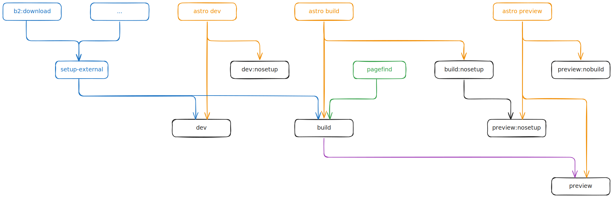

# chuangcaleb.com

Personal portfolio site to share (1) about myself + (2) content I've written. This v2 focuses on streamlining DX by leaning into CSS Variables.


## Getting Started

### Commands

Check [package.json](./package.json) for specific implementation.

| Command                | Action                                                                                      |
| :--------------------- | :------------------------------------------------------------------------------------------ |
| `pnpm install`         | Installs dependencies                                                                       |
| `pnpm dev`             | Starts local dev server at `localhost:4321`                                                 |
| `pnpm dev:nosetup`     | Runs dev without `setup:external`                                                           |
| `pnpm build`           | Build production site to `./dist/` (with `setup-external` + `pagefind` )                    |
| `pnpm build:nosetup`   | Only build without setup                                                                    |
| `pnpm preview`         | Run full build, then preview locally                                                        |
| `pnpm preview:nosetup` | Same as `preview`, but with `build:nosetup`                                                 |
| `pnpm preview:nobuild` | Same as `preview`, but without build step at all, so directly re-using existing local build |
| `pnpm format:check`    | Print code-format results with Prettier                                                     |
| `pnpm format:fix`      | Format all code with Prettier (will write)                                                  |
| `pnpm b2:download`     | Download b2 bucket to local `src/content` directory                                         |
| `pnpm pagefind`        | Index HTML notes with pagefind (from build `dist` directory)                                |
| `pnpm pagefind:dev`    | Run pagefind, but copy to public directory (for local dev)                                  |
| `pnpm setup:external`  | Syncs down external data; alias for `b2:download`                                           |
| `pnpm astro ...`       | Alias to run CLI commands like `astro add`, `astro preview`                                 |



## Architecture / Tech Stack

- Web Framework: [Astro](https://astro.build/)
- UI Component(s) Library: [Radix Primitives](https://www.radix-ui.com/primitives)
  - UI Library: [React](https://react.dev/)
- CSS/Design
  - Methodology: [CUBE CSS](https://cube.fyi/) ()
  - CSS Tokens: [Open Props](https://open-props.style/)
  - CSS Extension: [Sass/Scss](https://sass-lang.com/)
  - Preprocessing: [PostCSS](https://postcss.org/)
  - Fluid Responsive Design: [utopia-core-scss](https://github.com/trys/utopia-core-scss) @ [Utopia](https://utopia.fyi/)
- CMS: [Obsidian](https://obsidian.md/) + [Backblaze B2](https://www.backblaze.com/cloud-storage)
- Search: [Pagefind](https://pagefind.app)
- Deployment + CD: [Cloudflare Pages](https://pages.cloudflare.com/) (_headers,_redirects)
- Image CDN: [Cloudflare CDN](https://www.cloudflare.com/application-services/products/cdn/)

### Project structure

```tree
.
├── lib
│   ├── *
│   └── utils // utilities scoped to /lib
├── patches // generated by `pnpm patch`
├── public
│   ├── assets
│   │   ├── favicon
│   │   └── fonts
│   ├── _headers
│   └── _redirects // generated
└── src
    ├── assets // optimised local asset(s)
    ├── components
    │   ├── block // has logic, or has many elements
    │   ├── layout
    │   └── styled // just visually styled, no logic
    │       ├── monom / mono-morphic, fixed final HTML tag
    │       └── polym // poly-morphic, dynamic final HTML tag
    ├── content
    │   ├── project
    │   ├── obsidian-note // git submodule → obsidian-caleb-public
    │   │   └── **.md
    │   └── config.ts
    ├── data // structured static data
    ├── pages
    │   └── **
    │       └── _components // scoped helper components
    ├── styles
    │   ├── tokens
    │   │   ├── borders.scss
    │   │   ├── dynamic-colors.scss // color calculations
    │   │   ├── fluid.scss // utopia-core-scss fluid type generators
    │   │   ├── fonts.scss
    │   │   ├── sizes.scss
    │   │   ├── theme.scss // theme config
    │   │   └── composer.scss // composes everything in style rules, module default export
    │   ├── normalize // reset default agent styles
    │   ├── overrides // custom site styles
    │   ├── utilities // does one job well
    │   ├── fonts.css // @font-face declarations
    │   └── global.css // main css entry point
    └── utils // `/src`-specific utilities
```

Astro looks for .astro or .md files in the `src/pages/` directory. Each page is exposed as a route based on its file name, except if a route segment starts with an `_` (like `_components`).

There's nothing special about `src/components/`, but that's where any Astro/React/Vue/Svelte/Preact/etc. components live.

Any static assets, like images, can be placed in the `public/` directory if they do not require any transformation or in the `assets/` directory if they are imported directly.

## Design

This repo is the second iteration of my personal site, after [chuangcaleb/v1.chuangcaleb.com](https://github.com/chuangcaleb/v1.chuangcaleb.com).

Back then, I was still super novice at this whole web thing. I picked up the new trending tech (Astro + Tailwind). I'm proud of it, but I think my skills have upgraded since then.

As described above, v2 focuses on improving two interrelated objectives:

1. Developer Experience (DX)
2. Component variants via native CSS Variables

### Astro

I came into v1 from old-school Jekyll and diluting with newfound React. Was also new to Astro.

One obvious difference is not enforcing `index.ts` exports for every `.astro` file. Unnecessary.

Stuff used to be littered everywhere. Big change was code **co-location**. For example, the index page has a few major sections, soj I extracted each section into individual files. They used to live all the way in `src/components/block` — but were only used by one page. In cases like these, just co-locate these helper components like `./_components/ProjectsSection.astro` (taking advantage of how [filepaths with `_` don't get their own route](https://docs.astro.build/en/guides/routing/#excluding-pages)). This has made maintainability so much more obvious.

And also just leaning into co-locating css `<styles>` in `.astro` files themselves, rather than atomic classnames.

### CSS Methodology

I've extracted my writings about my past experience with and moving away from atomic-utility CSS, as it's not specific to this project. You can read about it at [What’s Next After Atomic-Utility CSS | chuangcaleb.com](https://chuangcaleb.com/notes/whats-next-after-atomic-utility-css).

#### Modern Syntax + CSS Variables

During this v2, implementing CSS Variables (aka CSS Properties) (and some modern CSS tricks!) ties the methodology together.

Here are some shoutouts:

- [argyleink/open-props: CSS custom properties to help accelerate adaptive and consistent design](https://github.com/argyleink/open-props) provides some zero-specificity standardised style tokens in CSS Variable form.
- [Axiomatic CSS and Lobotomized Owls – A List Apart](https://alistapart.com/article/axiomatic-css-and-lobotomized-owls/) was REVOLUTIONARY for me for controlling (rather, letting go of control of!) flowing prose layout — see [flow.css](src/styles/utilities/flow.css)
- [CSS Grid full-bleed layout tutorial](https://www.joshwcomeau.com/css/full-bleed/) — I struggled with full-bleed alternate-background-color sections
- [Layout Breakouts with CSS Grid](https://ryanmulligan.dev/blog/layout-breakouts/) takes the above concept further with _named grid lines_ for content layouts that breakout of the line-width. I may have gone overboard with **SIX** named breakpoints at [cgrid.css](src/styles/utilities/grid/cgrid.css)
- [utopia-core-scss](https://github.com/trys/utopia-core-scss) by [Utopia](https://utopia.fyi/) generates fluid-responsive CSS Variable tokens.

#### Color Scheme

A `color-[1-10]` color palette is neat, and it's easy to say "oh my button on hover needs to be one shade darker" — but then you've got some other elements which are slightly different shade on hover. We need **semantic** colors.

While tweaking my Obsidian, I found [obsidian-minimal's color scheme implementation](https://github.com/kepano/obsidian-minimal/blob/master/src/scss/variables/dynamic-color.scss) is great because it's (1) very extensible, (2) dynamically generated and (3) easy to use/great DX because of the semantic token names.

I'm still forming my adaptation of the color scheme system, the below is a WIP:

First, a particular theme defines `--base-[hsl]` and `--accent-[hsl]`.

```css
--base-h: 234;
--base-s: 21%;
--base-l: 18%;

--accent-h: 9;
--accent-s: 80%;
--accent-l: 65%;
```

Then we build four types/classes of tokens, with `n` number of color shades each:

- `--bg-[123]` - background (background)
- `--ui-[123]` - border (background)
- `--fg-[12349]` - text (foreground)
- `--ax-[1234]`- accent (foreground)

As `n` increases, _emphasis_ decreases — except for:

1. the last color shade of `bg` and `ui` colors, which are shades for being "active".
2. the last color shade of `fg` (`fg-9`), which is the opposite-contrast foreground shade, for use like as text color on accent-background buttons, which is technically not least in "emphasis".

For each specific shade, it will take the `hsl` segments and recompute a `hsl` color by modifying the `saturation` and `lightness` segments. Some shades may opt to utilize `hsla` and the opacity parameter.

```css
--bg2: hsl(var(--base-h), calc(var(--base-s) - 2%), calc(var(--base-l) - 4%));
// tip: hue segment is always unmodified
```

Then we can map these to more semantic tokens, for example:

```css
--border-primary: var(--ui1);
--border-secondary: var(--ui2);
--border-active: var(--ui3);

--text-strong: var(--fg1);
--text-normal: var(--fg2);
--text-faded: var(--fg3);
--text-muted: var(--fg4);
--text-on-accent: var(--bg2); // allow reusing base color shades
```

Finally, implementations can use the semantic tokens:

```css
:where(a[href]) {
  --color: var(--text-normal);
  // can use base color shades directly instead of semantic tokens:
  --color-underline: var(--ax3);
  --color-hover: var(--text-strong);
  color: var(--color);
  text-decoration-color: var(--color-underline);
}
// psuedo-variant
:where(a[href]:is(:hover, :focus, :active)) {
  --color-underline: var(--ax1);
  color: var(--color-hover);
}
// variant just re-defines local CSS Variables/Properties
a.accent {
  --color: var(--ax2);
  --color-hover: var(--ax1);
}
```

Which is so much clearer, concise and expressive than atomic classnames. Very minimal CSS Variable calculations, negligible performance hits — in fact it's a smaller CSS bundle lol.

And, we can generate colors on the fly, even client-side! (Coming soon to stores near you!)

See [dynamic-colors.scss](src/styles/config/dynamic-colors.scss).

#### Color Scheme (Advanced)

Dynamic color generation is more complicated when handling light/dark modes. While obsidian-minimal implements unique base modifiers for each color shade for each theme/mode, I preferred automatically handle this.

##### Lightness Coefficient

Foreground elements with decreasing emphasis gets dimmer in dark mode, but brighter in light mode. Reverse is true with background colors.

To put it simply: a shade's lightness modifier must be flipped/inverted between dark and light mode. We use `--m` as the light/dark Mode coefficient

- e.g. `--fg1: hsl( calc( var(--base-l) ${+/- n}% * var(--m) ) )`
- is used to flip the +/-ve direction of lightness modifiers
  - dark mode: 1 (fg emphasis gets lighter against dark bg)
  - light mode: -1 (fg emphasis gets darker against light bg)
- can use decimal numbers, greater magnitude increases lightness-contrast between shades

##### Accent Lightness Coefficient

After Lightness is flipped appropriately, there's another issue: accent colors are usually bright. Dark mode requires less contrast between accent shades than in light mode. One mode will always have the wrong degree of contrast between shades.

So just introduce a new variable lol, `--a-l` as the Accent Lightness coefficient to work together with the Lightness coefficient, only for accent shades

- e.g. `--ax1: hsl( calc( var(--base-l) ${+/- n}% * var(--m) * var(--a-l) ) )`
- is used to increase difference in Lightness between _accent_ shades
- larger magnitudes for light mode with light bg, since accents also have high lightness

##### Handling exceptions

1. `--bg2` is always a darker shade than `--bg1`, so we just exclude passing `--m` into `--bg2`'s shade calculation.
2. `--fg1` should always automatically be the lightest/darkest black/white color available — so just set the Lightness component to a 95-100% and let the `--m` coefficient flip it according to light/dark mode.

<!-- I think the CSS Variables also just matured enough for people to iterate enough with it. -->

### Obsidian Notes

#### Context

I write my content locally in Obsidian and want to display them in the Astro site. I already version control with git, ~~so I didn't need to reach for another remote cloud sync option~~ but my public notes are mixed in with private ones. I don't want to expose all my personal journal notes lol. Just those files/notes ~~in select folders/directories or~ passing some frontmatter condition.

One way would be to nest the obsidian vault repository within the Astro repository, and gitignore bad paths. But then that would load all Obsidian notes locally. A [previous implementation](chuangcaleb.github.io/wtsa) was to nest the Astro repository at a public directory of the Obsidian vault repository.

But in the end, both ways will source control the content files, so I had [a bunch of content-commits in between my source-code-commits](https://github.com/chuangcaleb/wtsa/commits/source/). I no likey. I reached for some CMS solutions but that was over-engineering for now.

#### Processing

~~Currently, I make use of the [kometenstaub/metadata-extractor](https://github.com/kometenstaub/metadata-extractor) plugin to dump the metadata cache of my entire Obsidian workspace, to a local `.json` file.~~ I had simplified a script to directly read from directory.

I run a custom script to process that metadata cache to ~~filter out private note~~ select all notes with a frontmatter, and reorganize nested paths to root. The next step copies the processed list of markdown files and writes their new filepaths into an output directory. All this processing is `gitignored` in my main Obsidian repo.

#### Syncing

That output folder is synced to the cloud using ~~git~~ ~~Google Drive~~ B2 Backblaze.

I had previously git-tracked this output directory and attached that repository as a [submodule](.gitmodules) that would reside in this repo at [`src/content/obsidian-note`](src/content/obsidian-note). It was simple and was my working solution for months... but (1a) version controlling non-source-code-data felt wrong, (2) I didn't want to look into safely running shell commands for stuff like `git push`. (1b) I also intend to sync up my non-markdown assets like images.

2nd solution was using [Google Drive Desktop](https://workspace.google.com/products/drive/#download). I set my local output folder of markdown files for syncing up to the Drive. I used the same [Google Service Account](https://developers.google.com/identity/protocols/oauth2/service-account) from the [guestbook feature](https://chuangcaleb.com/notes/making-my-website-guestbook/) to download the files with [googleapis - npm](https://www.npmjs.com/package/googleapis) to the `src/content/obsidian-note/` folder. For implementation details, see [[lib/google/drive/download-folder.ts]].

It was an alright solution! There's no sensitive information. I just need a few MB's of cloud bucket storage, and this simple + free solution is easily better than provisioning an S3 bucket and all that.

But I eventually found Backblaze B2, and figured out how to handle allat.

Syncing up uses the `b2` CLI.

```shell
b2 sync
 \ --delete # mirror, delete on remote if not found in local
 \ --compare-versions size # see note below
 \ --replace-newer # vs. skip-newer
 \ --exclude-regex '.*\\.DS_Store$' # ignores .DS_Store's
 \ '/Users/chuangcaleb/Documents/Obsidian/obsidian-caleb/system/cloud-sync'
 \ b2://obsidian-caleb
```

Note: currently `b2 sync` cannot track diff by SHA1
So we are using next best, file size
[sync — B2_Command_Line_Tool 4.0.2 documentation](https://b2-command-line-tool.readthedocs.io/en/master/subcommands/sync.html)

Syncing down necessitates the `backblaze-b2` package from `npm` (instead of `b2` CLI), because it needs to be executed in the `node` environment of the cloud runner during `build`. See [lib/b2/index.mjs](lib/b2/index.mjs) for implementation.

The pre-upload processing script is currently in my private repo, it just doesn't belong anywhere else, it's very customized. I can share it upon request.
